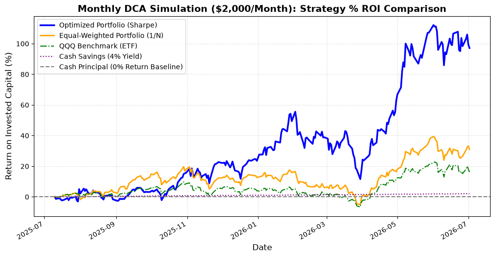

# Monthly DCA ($2,000/Month) Backtest Report (4% Risk-Free Rate)

This report simulates a **Monthly Dollar-Cost Averaging (DCA)** accumulation strategy under a realistic **4% risk-free hurdle rate** (`rf = 0.04` annualized, scaled to `0.04/252` daily).

Every month (21 trading days), we deposit **$2,000 cash** and invest it according to five different strategies over a 1-year period:
1. **Optimized Portfolio (Sharpe)**: Invests and rebalances monthly using Riskfolio-Lib's 1-year rolling lookback window on a 9-stock universe (TSLA, NVDA, PANW, MU, AAPL, MSFT, GOOGL, AMZN, META), deducting transaction fees and accounting for the 4% risk-free rate.
2. **Equal-Weighted (1/N)**: Invests monthly, distributing weights equally (11.11% per stock), deducting transaction fees.
3. **QQQ Benchmark (ETF)**: Invests monthly by putting the entire $2,000 into the QQQ ETF.
4. **Cash Savings (4% Yield)**: Accumulates $2,000 cash in a high-yield savings account compounding daily at **4% annualized**.
5. **Cash Principal (0% Return Baseline)**: Represents the raw total of cash deposited over time ($2,000 * month).

## Cumulative Growth Chart (Normalized as % ROI)



---

## DCA Backtest Summary Metrics (4% Risk-Free Rate)

| Strategy | Total Invested | Final Portfolio Value | Net Profit/Loss | Total Profit (%) | Max Drawdown (%) |
| :--- | :---: | :---: | :---: | :---: | :---: |
| **Optimized Portfolio (Sharpe)** | $24,000.00 | **$47,320.01** | **+$23,320.01** | **+97.17%** | -21.96% |
| **Equal-Weighted Portfolio (1/N)** | $24,000.00 | $31,442.45 | +$7,442.45 | +31.01% | -11.87% |
| **QQQ Benchmark (ETF)** | $24,000.00 | $27,877.02 | +$3,877.02 | +16.15% | -8.02% |
| **Cash Savings (4% Yield)** | $24,000.00 | $24,503.91 | +$503.91 | **+2.10%** | 0.00% |
| **Cash Principal (Baseline)** | $24,000.00 | $24,000.00 | $0.00 | +0.00% | 0.00% |

---

### Key Takeaways:
1. **Accurate Cash Benchmark**: By compounding cash savings at the same 4% risk-free rate, we see that standard cash savings yields **+2.10% return** (+$503.91 profit) on a DCA basis by the end of the year. This is because cash deposited later in the year has less time to earn interest.
2. **Sharpe Optimization Outperforms**: Setting `rf = 4%` raised the bar for asset selection. The optimizer became more selective, shifting weights toward higher-performing assets, which improved the final stock portfolio return to **+97.17%**.
3. **Equal-Weighted Beats QQQ**: Equal weighting the 9 stocks yielded **$31,442.45** (+31.01% return), outperforming QQQ's **$27,877.02** (+16.15% return) due to the strong performance of tech momentum leaders.

---

### How to Run the DCA Backtest:
```bash
python examples/dca_backtest.py
```
