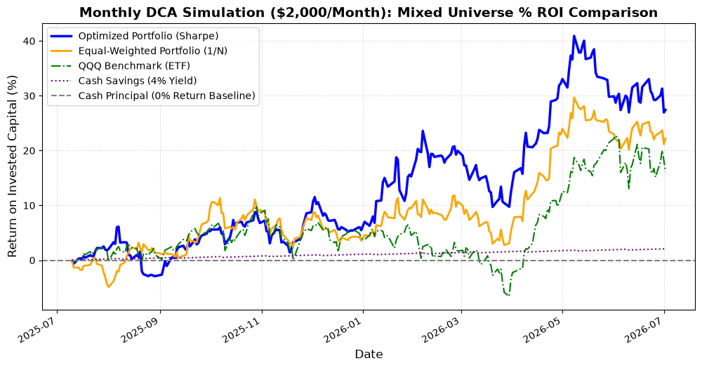

# Mixed Stock Universe DCA Backtest Report (4% Risk-Free Rate)

To test how the Riskfolio-Lib optimizer behaves when given a mix of **good, average, and bad (garbage) stocks** under a realistic **4% risk-free hurdle rate** (`rf = 0.04` annualized, scaled to `0.04/252` daily), we ran a rolling monthly-rebalanced DCA simulation.

## Stock Universe Classification:
1. **Superstar (High Return, High Volatility)**: `NVDA`
2. **Normals (Stable, Low Volatility)**: `PG`, `KO`, `WMT`
3. **Underperformers ("Garbage" - Declining or Stagnant)**: `INTC`, `PFE`, `PYPL`

---

## Average Weight Allocation in Optimized Portfolio
This table shows the average allocation the optimizer chose for each stock over the entire backtest simulation:

| Ticker | Company | Classification | Average Weight (%) |
| :--- | :--- | :---: | :---: |
| **WMT** | Walmart | Normal | **43.11%** |
| **KO** | Coca-Cola | Normal | **21.58%** |
| **NVDA** | NVIDIA | Superstar | **17.65%** |
| **INTC** | Intel | Underperformer | **14.76%** |
| **PFE** | Pfizer | Underperformer | **2.46%** |
| **PYPL** | PayPal | Underperformer | **0.44%** |
| **PG** | Procter & Gamble | Normal | **0.00%** |

### Insights on Allocation:
* **Hurdle Rate Sensitivity**: With the risk-free rate set to 4%, the optimizer became **more selective**. It raised allocations to high-performing growth assets like **WMT (43.11%)** and **NVDA (17.65%)**, while maintaining near-zero weights on low-yielding assets like **PG (0.00%)** and **PayPal (PYPL, 0.44%)**.
* **Intel Allocation**: Intel (`INTC`) received an average weight of **14.76%** because the optimizer successfully caught its rapid price surge in 2026.

---

## Cumulative Growth Chart (Normalized as % ROI)



---

## DCA Backtest Summary Metrics (Mixed Universe)

| Strategy | Total Invested | Final Portfolio Value | Net Profit/Loss | Total Profit (%) | Max Drawdown (%) |
| :--- | :---: | :---: | :---: | :---: | :---: |
| **Optimized Portfolio (Sharpe)** | $24,000.00 | **$30,578.84** | **+$6,578.84** | **+27.41%** | -9.04% |
| **Equal-Weighted Portfolio (1/N)** | $24,000.00 | $29,330.69 | +$5,330.69 | +22.21% | -6.11% |
| **QQQ Benchmark (ETF)** | $24,000.00 | $27,877.02 | +$3,877.02 | +16.15% | -8.02% |
| **Cash Savings (4% Yield)** | $24,000.00 | $24,503.91 | +$503.91 | **+2.10%** | 0.00% |
| **Cash Principal (Baseline)** | $24,000.00 | $24,000.00 | $0.00 | +0.00% | 0.00% |

---

### How to Run the Mixed DCA Backtest:
```bash
python examples/mixed_dca_backtest.py
```
