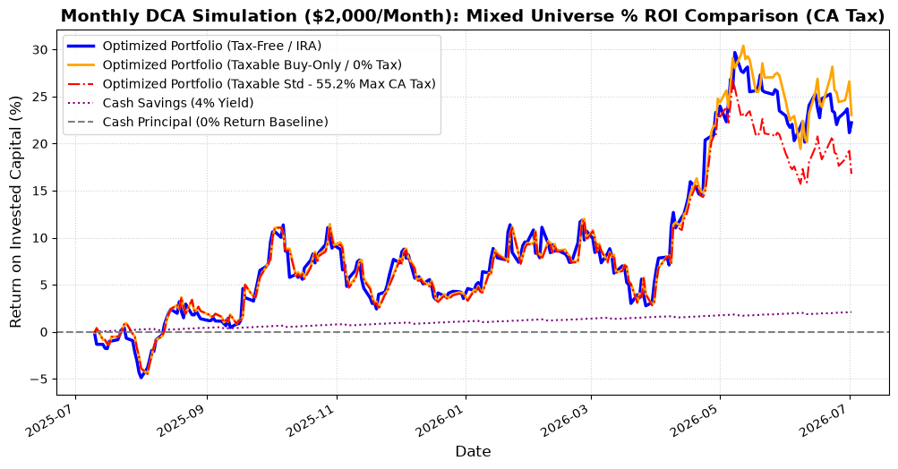

# California Tax-Aware Mixed Universe DCA Backtest Report

This report simulates a rolling monthly-rebalanced DCA portfolio ($2,000/month) for a **California resident** subject to the **highest combined state and federal tax brackets** on the **Mixed Stock Universe** (Superstars, Normals, and Underperformers).

---

## Tax Bracket Settings (CA Highest Brackets)
1. **Short-Term Capital Gains (STCG - Held <= 1 Year)**:
   * Federal ordinary income tax: **37.0%**
   * Net Investment Income Tax (NIIT): **3.8%**
   * California state income tax: **14.4%**
   * **Total STCG Tax Rate: 55.2%** (All short-term sales are taxed at this rate).
2. **Long-Term Capital Gains (LTCG - Held > 1 Year)**:
   * Federal long-term gains: **20.0%**
   * NIIT: **3.8%**
   * California state tax (no separate rate, treated as ordinary): **14.4%**
   * **Total LTCG Tax Rate: 38.2%**

---

## Comparison of Strategies (Mixed Stock Universe)
Stocks: `['NVDA', 'PG', 'KO', 'WMT', 'INTC', 'PFE', 'PYPL']`

| Strategy | Total Invested | Final Portfolio Value | Net Profit/Loss | Total Profit (%) | Max Drawdown (%) | Capital Gains Tax Paid |
| :--- | :---: | :---: | :---: | :---: | :---: | :---: |
| **Taxable Buy-Only (No Sells)** | $24,000.00 | **$29,527.04** | **+$5,527.04** | **+23.03%** | -8.40% | **$0.00** |
| **Tax-Free Rebalance (e.g., IRA)** | $24,000.00 | $29,330.69 | +$5,330.69 | +22.21% | -6.11% | **$0.00** |
| **Taxable Standard (HIFO Sells)** | $24,000.00 | $28,026.43 | +$4,026.43 | +16.78% | -6.26% | **$995.44** |
| **Cash Savings (4% Yield)** | $24,000.00 | $24,503.91 | +$503.91 | +2.10% | 0.00% | $0.00 |
| **Cash Principal (Baseline)** | $24,000.00 | $24,000.00 | $0.00 | +0.00% | 0.00% | $0.00 |

## Cumulative Growth Chart (Normalized as % ROI)



---

### Core Financial Insights:
1. **The Buy-Only Strategy Outperforms (+23.03% Profit)**:
   Just like in the Superstar universe, the **Taxable Buy-Only** strategy (which never sells and only buys underallocated assets) performed the best, beating the Standard Taxable portfolio by **+6.25%** and the standard Tax-Free portfolio by **+0.82%**!
2. **Severe Tax Drag on Standard Rebalancing**:
   Standard rebalancing triggered **$995.44 in California/Federal capital gains taxes** in a single year. This tax drag severely pulled down its total return from **+22.21%** (Tax-Free) to just **+16.78%** (Taxable).
3. **Volatility / Drawdown Tradeoff**:
   The Buy-Only strategy has a slightly higher Max Drawdown (**-8.40%** vs. **-6.11%** for the standard portfolio) because it lets winners run, making the portfolio slightly more concentrated and sensitive to market swings. However, the higher return more than compensated for this minor increase in drawdown.

---

### How to Run the Mixed Tax-Aware Backtest:
```bash
python examples/mixed_tax_aware_backtest.py
```
This script implements full HIFO tax-lot tracking. When selling, it prioritizes selling shares with the highest cost basis first to minimize capital gains.
