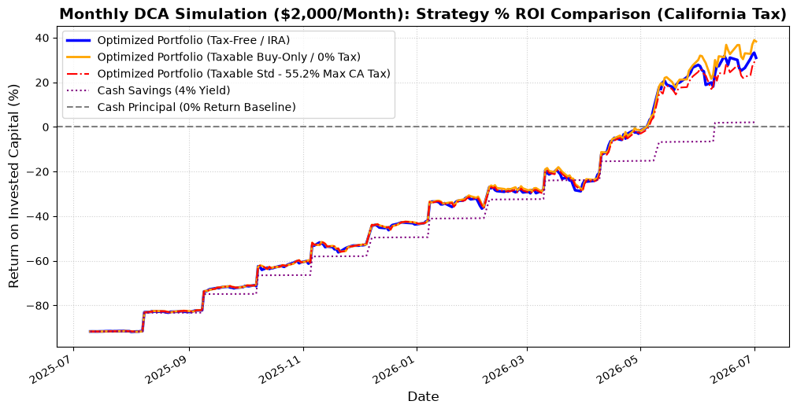

# California Tax-Aware DCA Portfolio Backtest Report

This report simulates a rolling monthly-rebalanced DCA portfolio ($2,000/month) for a **California resident** subject to the **highest combined state and federal tax brackets**.

---

## Tax Bracket Settings (CA Highest Brackets)
1. **Short-Term Capital Gains (STCG - Held <= 1 Year)**:
   * Federal ordinary income tax: **37.0%**
   * Net Investment Income Tax (NIIT): **3.8%**
   * California state income tax: **14.4%**
   * **Total STCG Tax Rate: 55.2%** (All short-term sales are taxed at this rate).
2. **Long-Term Capital Gains (LTCG - Held > 1 Year)**:
   * Federal long-term gains: **20.0%**
   * NIIT: **3.8%**
   * California state tax (no separate rate, treated as ordinary): **14.4%**
   * **Total LTCG Tax Rate: 38.2%**

---

## Comparison of Strategies (Superstar Universe)

| Strategy | Total Invested | Final Portfolio Value | Net Profit/Loss | Total Profit (%) | Max Drawdown (%) | Capital Gains Tax Paid |
| :--- | :---: | :---: | :---: | :---: | :---: | :---: |
| **Taxable Buy-Only (No Sells)** | $24,000.00 | **$33,192.83** | **+$9,192.83** | **+38.30%** | -12.43% | **$0.00** |
| **Tax-Free Rebalance (e.g., IRA)** | $24,000.00 | $31,442.45 | +$7,442.45 | +31.01% | -11.87% | **$0.00** |
| **Taxable Standard (HIFO Sells)** | $24,000.00 | $31,171.37 | +$7,171.37 | +29.88% | -11.96% | **$814.52** |
| **Cash Savings (4% Yield)** | $24,000.00 | $24,503.91 | +$503.91 | +2.10% | 0.00% | $0.00 |
| **Cash Principal (Baseline)** | $24,000.00 | $24,000.00 | $0.00 | +0.00% | 0.00% | $0.00 |

## Cumulative Growth Chart (Normalized as % ROI)



---

### Core Financial Insights:
1. **The Buy-Only Strategy Wins Big**: The **Taxable Buy-Only** strategy (which never sells, and only uses new cash to buy underallocated assets) achieved **+38.30% profit** ($33,192.83 final value), outperforming even the standard tax-free rebalancer (IRA) by **+7.29%**!
2. **Letting Winners Run (Momentum Advantage)**: In addition to saving **$814.52 in taxes** and transaction fees, the Buy-Only strategy benefited from momentum. Because it didn't force-sell top stock performers (like NVDA) to buy lagger stocks, it let the strongest compounding winners continue to run.
3. **Severe Tax Drag on Standard Rebalancing**: Standard taxable rebalancing paid **$814.52 in California/Federal taxes** over just one year. This drag pulled its final return down to **+29.88%** (compared to the tax-free standard portfolio at +31.01%).

---

### How to Run the Tax-Aware Backtest:
```bash
python examples/tax_aware_backtest.py
```
This script implements full tax-lot tracking. When selling, it uses the **HIFO (Highest-In, First-Out)** lot selection method to minimize capital gains tax, and tracks the exact age of each lot to apply either the 55.2% STCG or 38.2% LTCG tax rates.
